# 双层 AFM-CrI\(_3\) 量子光 HHG：课题整体状况与执行总账

> [!important] 阅读口径
> 本文是截至 **2026-08-10** 的详细状态快照，综合了仓库 `docs/` 工作记录、数值结果、Git 历史与作业验收报告。本文严格区分：**已完成、已验证、探索性结果、失败但有诊断价值、正在收口、尚未开始**。
>
> 当前无法从本地直接取得新的服务器队列快照。因此，“正在做”只写有本地脚本、Git 和工作记录支持的事项；**没有证据证明正式 GH5 或新的生产作业正在运行**。

> [!note] 两份副本与证据链接
> 仓库中的本文件是证据链接与图路径的权威版本；Obsidian 中保存同内容镜像，便于课题规划阅读。若 Obsidian 镜像里的仓库相对链接无法解析，请打开[仓库原文件](file:///C:/Users/26507/Documents/New_SBEs/Quantum-light/docs/00_%E5%BD%93%E5%89%8D%E7%8A%B6%E6%80%81/%E8%AF%BE%E9%A2%98%E6%95%B4%E4%BD%93%E7%8A%B6%E5%86%B5_20260810_%E8%AF%A6%E7%BB%86%E7%89%88.md)。

---

## 0. 技术摘要：现在到底进行到哪里

### 0.1 一句话结论

$$
\boxed{
\text{经典材料与磁序算符基线基本封板；层 A0 代码已完成、full112 GH3 已完成；}
\quad
\text{GH5、A1 和真正的输出光子统计尚未完成。}
}
$$

### 0.2 当前最重要的四项判断

1. **固定基准场的低中阶 HHG 已有受控少带模型。**在
   \(\lambda=3200\,\mathrm{nm}\)、\(I=2\times10^{11}\,\mathrm{W/cm^2}\)、CEP \(=90^\circ\)、\(T_2=0.5\) cycle 下，M88-c20@k40 可用于普通 H1–H9 与磁序奇通道 \(J_o\) H2–H8；k60 是验收网格。
2. **该结论不能外推到 Gaussian-\(Q\) 的高场尾。**高场节点达到约 \(1.63\times10^{12}\,\mathrm{W/cm^2}\)，并覆盖多个 CEP；27757、27796、27828 已证明 M88-full 在 H2/H9/H10 上仍有模型空间缺失，因此层 A 后续应使用 full112。
3. **当前量子光代码只完成“量子输入对平均谱的影响”。**ICS、CS 与轨迹矩仍是 Husimi-\(Q\) 正权重经典轨迹混合，不能称为输出量子 \(g^{(2)}\)、压缩、纠缠或量子优势。
4. **正式 full112 GH5 仍关闭。**还需关闭两道门：同 binary、同运行拓扑的“分块 vs 未分块”严格等价门；CEP-\(\pi\) 弱信号判据的正式定义与复验。

### 0.3 当前决策表

| 科学目标 | 推荐模型与网格 | 当前地位 | 理由 |
|---|---|---|---|
| 固定基准场普通 H1–H9 | M88-c20@k40；k60 验收 | **已定量验收** | P2：复振幅与相位通过 |
| 固定基准场 \(J_o\) H2–H8 | M88-c20@k40；k60 验收 | **已定量验收** | P2：最大复误差约 6.6% |
| 固定基准场 \(J_o\)-H10 | M88-full@k60 | **有条件参考** | c20 对 H10 复误差 45.8% |
| Gaussian-\(Q\) 高场/多 CEP 平均谱 | full112；GH3/GH5 先 k20，贡献节点再 k40/k60 | **当前正式 parent** | M88 高场模型门失败，且 k40 后差异不消失 |
| H11–H12 | 至少 full112，逐项收敛 | **有条件** | M88 H11 已明显漏通道 |
| H13–H15 | full112 + 峰/背景审计 | **探索性** | 弱信号与高能子空间风险增大 |
| H16–H26 | 扩展 Wannier/高导带模型对比 full112 | **未闭环** | 3200 nm 的 H26 约 10.1 eV，当前母空间未验收至此 |
| 真正输出量子统计 | B0→B1→B2 | **尚未开始生产实现** | 需要两时电流关联和量子输入–输出理论 |

> [!warning] 禁止拼谱
> “H1–H9 用 M88-c20、H10 用 M88-full、H11+ 用 full112”可作为**分层验收策略**，但不能把三种模型的谐波片段拼成一条物理谱。每个模型都对应自己的完整 \(J(t)\)、复相位、Berry connection 与归一化；正式图应展示各自完整谱或明确的模型对照。

---

## 1. 研究问题、理论分层与状态定义

### 1.1 核心科学问题

$$
\boxed{
\text{双层 AFM-CrI}_3\text{ 的 Néel 磁序如何写入 HHG 的幅度、相位与选择定则，}
\quad
\text{并进一步控制不同谐波模之间的量子关联？}
}
$$

研究必须按逻辑依赖分层，不能把“量子驱动改变平均谱”和“输出谐波具有非经典统计”混为一谈。

| 层级 | 计算对象 | 当前状态 | 当前允许的声明 |
|---|---|---|---|
| L0 | QE/Wannier、\(H,r,v\)、经典 SBE、\(\pm\mathbf N\)、模型与 k 收敛 | **主体完成** | 可讨论经典幅度、相位、选择定则、模型边界 |
| Q0 | Gaussian Husimi-\(Q\) 节点的一、二阶矩 | **完成** | 可声明输入采样器正确 |
| A0 | 复数 \(J_n\)、ICS、CS、共享 \(\pm\mathbf N\) 节点、分块传播 | **代码完成；生产求积仍验收中** | 可讨论平均谱与 classical-mixture benchmark |
| A1 | 跨谐波轨迹矩 \(A_{nm},B_{nm},F_{nm}\) | **未实现** | 尚不能给 classical-mixture 相关矩阵 |
| B0 | 小系统 Fock/Wick/Lindblad-QRT 两时关联基准 | **未开始** | 尚不能声明电流量子噪声 |
| B1 | CrI\(_3\) 两时电流关联 | **未开始** | 尚不能构造真实输出二阶量子矩 |
| B2 | \((\beta,N,M,V)\)、Gaussian 压缩/\(g^{(2)}\)/纠缠 | **未开始** | 尚不能声明压缩或纠缠 |
| C0 | 四时关联与非 Gaussian 修正 | **未开始** | 尚不能给精确一般 \(g^{(2)}\) |
| QADV | 同资源约束下量子–经典比较 | **未开始** | 目前不能判断量子优势 |

### 1.2 当前依赖链

```mermaid
flowchart LR
  A["QE + Wannier 母模型"] --> B["L0: H,r,v 与经典 SBE"]
  B --> C["固定场模型验收: M88-c20 / full112"]
  C --> D["A0: Gaussian-Q 平均谱"]
  D --> E["同 binary 分块门 + CEP-π 门"]
  E --> F["full112 GH5@k20"]
  F --> G["贡献节点 k40 / 必要时 k60"]
  G --> H["A1: classical-mixture 跨模矩"]
  H --> I["B0: 小系统两时关联基准"]
  I --> J["B1/B2: CrI3 输出协方差与非经典见证"]
  J --> K["C0/QADV: 四时关联与量子优势"]
```

---

## 2. 材料、Wannier 与经典 SBE 路线

## 2.1 full112 为什么是母参考，而不是“带数过多的失败模型”

full112 的化学组成是

$$
4\,\mathrm{Cr}\times5d\times2_{\mathrm{spin}}
+12\,\mathrm I\times3p\times2_{\mathrm{spin}}
=112.
$$

- 轨道：全部 Cr-\(d\) 与全部 I-\(p_x,p_y,p_z\) 旋量轨道；
- 占据带：84；
- 角色：材料真实性、位置/偶极/电流算符、高阶与少带模型的母参考；
- \(\Gamma\) 点带隙约 \(0.6672\,\mathrm{eV}\)。

对 CrI\(_3\) 这种 16 原子、强 SOC、AFM、I-\(p\)/Cr-\(d\) 强杂化体系，112 维并不反常。复杂材料 HHG 文献也常保留化学上完整的多轨道空间：

- 单层 ReS\(_2\)：44 个 MLWF，完整传播密度矩阵，并在传播后做轨道分辨，而不是预先粗暴删轨道；见 [Nature Communications 14, 8055 (2023)](https://www.nature.com/articles/s41467-023-44041-0)。
- 固态 C\(_{60}\)：120 条价带 + 40 条导带，共 160 条带；见 [多带 Liouville 计算预印本/报告](https://www.osti.gov/servlets/purl/1657852)。
- Ag：使用化学上完整的 \(s+p+d\) 九轨道组覆盖费米面以上约 15 eV；见 [arXiv:2503.05073](https://arxiv.org/abs/2503.05073)。

这些研究支持的不是“所有体系都要上百带”，而是：

$$
\boxed{
\text{先保留覆盖目标能区和光学矩阵元的物理完整空间，}
\quad
\text{再按目标谐波作受控缩减。}
}
$$

## 2.2 40-WF d-only：为什么能带看起来尚可，HHG 仍失败

40-WF 只保留 Cr-\(d\) 旋量轨道。先后存在两个不同 disentanglement 版本：

| 版本 | 外窗 / 冻结窗 | 占据数 | 物理含义 |
|---|---|---:|---|
| pilot | \([-2,3]/[-1,1]\) eV | 22 | 把部分 I-\(p\) 杂化价带硬吸收到 d 中心 WF |
| opt1 | \([-1.8,3.5]/[-0.6,0.9]\) eV | 12 | 更接近离子 Cr-\(d^3\)，但丢失 I-\(p\) 富价带 |

虽然局部带隙可拟合到约 meV 量级，但 QE 投影显示：

- 价带顶 Cr-\(d\) projectability 仅约 0.035–0.056；
- 第一导带簇约 0.40–0.47；
- 第二导带簇才约 0.81–0.86。

因此价带顶本质是 I-\(5p\) 主导。纯 d 基组无法同时正确描述价带载体、Berry connection、偶极矩阵与远带相消。HHG 的决定性结果是：

- H1 仅为 nb1-104 的约 0.344；
- H6 约为 6.59 倍；
- H10+ 可出现 \(10^2\)–\(10^3\) 倍偏差。

$$
\boxed{
\text{能带或带隙拟合良好}\not\Rightarrow
\text{位置/偶极、电流与 HHG 正确。}
}
$$

图证据：

- [QE、full112 与 d-only40 近带隙对照](../08_QE与Wannier/figures/CrI3_qe_wannier112_donly40_1x3_near_gap.png)
- [d-only40 与 full112 的 HHG 对照](../08_QE与Wannier/figures/CrI3_HHG_donly40_nb104_112_1x3.png)
- [40-WF pilot 与 opt1 对照](../08_QE与Wannier/figures/CrI3_donly40_pilot_vs_opt1_sidebyside.png)

当前定位：40-WF 可用于流程、编译和小规模算法冒烟，不用于 CrI\(_3\) 定量 HHG 结论。

## 2.3 M52、M64、M88 的设计动机与结果

| 模型 | 轨道内容 | 占据带 | 建模目的 | 最终定位 |
|---|---|---:|---|---|
| M52 | Cr-d + 六个界面 I 的 pz | 24 | 检查界面 pz/层间机制 | 机制模型 |
| M64 | Cr-d + 全部 I-pz | 36 | 检查层间 pz 通道 | 数值病理诊断；退出生产 |
| M88 | Cr-d + 全部 I-px/py | 58 | 保留面内 d-p 光学通道 | 最佳 reduced Wannier parent |

M88 之所以胜出，不只是因为谱“看起来像”。SVD/hopping 子块分析显示：

- M88 保留约 81% 的层内 d-p 权重；
- hopping 可表示性约 65%；
- M64 约 30%，M52 约 16%，纯 d 约 6%。

M64 虽可拟合能带，却出现：

- 位置矩阵反厄米残差偏大；
- \(J(0)\sim2\times10^{-9}\)；
- 外场驱动后 H10+ 异常增强。

零场运行没有相同高阶峰，说明异常是光场诱导的动力学/矩阵元问题，不是简单的 DC FFT 泄漏。M64 不再承担生产任务。

## 2.4 M88-c20、M88-c10 与“30 带”测试到底是什么

M88-c20 与 M88-c10 不是新的 Wannier 化，而是对完整 M88 parent 对角化后，在 Bloch 本征带空间选择 active bands：

$$
\mathrm{M88\!-!c20}=58v+20c=78\ \mathrm{bands},
$$

$$
\mathrm{M88\!-!c10}=58v+10c=68\ \mathrm{bands}.
$$

M52 上的对应实验为

$$
\mathrm{M52\!-!c6}=24v+6c=30,
\qquad
\mathrm{M52\!-!c10}=24v+10c=34.
$$

S2 结果显示：M52-c6 的 H5 强度相对 M52 parent 约为 16.27 倍，即电流振幅伪放大

$$
\sqrt{16.27}\simeq4.03.
$$

增加第 7–10 条导带后，M52-c10 又接近 parent，说明少数被删除导带参与了重要虚跃迁与通道相消。

正确结论是：

$$
\boxed{
\text{裸 }24v+6c\text{ 的 30-band 截断失败；}
\quad
\text{并未证明所有经过 downfolding 的 30-band 有效理论都不可能。}
}
$$

若要把模型压到约 30 带，需要 composite subspace/downfolding，并同时重整化 \(r_{\rm eff},v_{\rm eff},J_{\rm eff}\)，不能只调 `nb_end`。

图证据：

- [S2 各截断完整 HHG 对照](../../results/S2_truncation_pmN_20260720/figures/fig1_S2_hhg_overlay.png)
- [S2 强度比](../../results/S2_truncation_pmN_20260720/figures/fig2_S2_hhg_ratio_vs_parent.png)
- [S2 磁序奇通道相对 full112](../../results/S2_truncation_pmN_20260720/figures/fig3_S2_Jo_vs_full112.png)

## 2.5 为什么正式 SBE 路线选择 `lg_cov`

早期对称 20–60 带 Peierls/velocity-gauge 窗口曾出现：

- H1/H3 比 full112 大 3–4 个数量级；
- 随带数增加不单调收敛；
- matrix velocity gauge 与 Peierls 实现不一致。

根因是对称砍带删除了大量深价带，破坏填满价带的背景电流、f-sum 与规范相消。正式路线改为协变长度规范

$$
\boxed{\texttt{lg\_cov}}
$$

并采用

$$
\boxed{\text{保留全部占据带，再逐步增加导带。}}
$$

这与有限带 SBE 中对 gauge consistency 的标准警告一致；参见 [Yue & Gaarde, Phys. Rev. B 100, 195201 (2019)](https://link.aps.org/doi/10.1103/PhysRevB.100.195201)。

full112 母空间中：

- nb1-94 = 84v+10c；
- nb1-104 = 84v+20c；
- full112 = 84v+28c。

在正式 \(T_2=0.5\) cycle 下，nb1-104 的可靠口径应收紧为 H1–H9；H10/H11 已开始偏离。

## 2.6 磁畴、\(J_e/J_o\) 与 P 共轭算符链

对每个谐波复电流定义

$$
J_{e,q}=\frac{J_q(+\mathbf N)+J_q(-\mathbf N)}{2},
\qquad
J_{o,q}=\frac{J_q(+\mathbf N)-J_q(-\mathbf N)}{2}.
$$

- \(J_e\)：对 Néel 反转为偶的通道；理想线偏振情形主要承载奇次谐波；
- \(J_o\)：对 Néel 反转为奇的磁性通道；主要承载偶次谐波。

独立 DFT/Wannier 得到的 \(\pm\mathbf N\) 不一定严格互为 P 共轭。构造实空间 P 共轭 TB 后，H2 leakage 从 13.1 降至 0.321，改善约 41 倍；错误的 even-N H2 回到正确的 odd-N 通道。

stored-gauge 算符门已通过：

| 门 | 结果 |
|---|---:|
| \(\varepsilon_P^S\)：Hamiltonian | median \(\sim1.7\times10^{-16}\) |
| \(\varepsilon_r^S\)：位置算符 | median \(\sim1.2\times10^{-10}\) |
| \(\varepsilon_v^S\)：速度算符 | median \(\sim8\times10^{-12}\) |
| 谱共轭 | worst \(\sim2.4\times10^{-14}\,\mathrm{eV}\) |

这说明经典 \(\pm\mathbf N\)、\(J_e/J_o\) 与 `lg_cov` HHG 的算符前提已满足；但它不等同于 QRT 或量子光输出统计就绪。

双层 AFM-CrI\(_3\) 的磁序诱导非互易 SHG 有实验基础，见 [Sun et al., Nature 572, 497–501 (2019)](https://www.nature.com/articles/s41586-019-1445-3)。

## 2.7 P2 固定场最终验收

定义复数带截断误差与相位差

$$
\epsilon_{\rm band}(q)
=\frac{|J_q^{78}-J_q^{88}|}{|J_q^{88}|+\delta},
$$

$$
\Delta\phi_q=\arg\!\left[J_q^{78}(J_q^{88})^*\right],
$$

其中 \(J_q^{78}\) 来自 M88-c20，\(J_q^{88}\) 来自 M88-full，\(\delta\) 是弱信号保护量。

P2 作业 26912–26915 共 **41 PASS / 1 FAIL**：

| 通道 | 阶数 | 振幅比 \(|J^{78}|/|J^{88}|\) | 复误差 | 相位差 | 结论 |
|---|---:|---:|---:|---:|---|
| 普通 \(J\) | H1 | 0.9554 | 5.04% | 0.0229 rad | PASS |
| 普通 \(J\) | H3 | 1.0022 | 0.29% | 0.0019 | PASS |
| 普通 \(J\) | H5 | 0.9954 | 1.75% | 0.0210 | PASS |
| 普通 \(J\) | H7 | 0.9905 | 1.25% | 0.0043 | PASS |
| 普通 \(J\) | H9 | 0.9857 | 7.49% | 0.0742 | PASS |
| \(J_o\) | H2 | 0.9487 | 6.62% | 0.0018 | PASS |
| \(J_o\) | H4 | 0.9968 | 0.51% | 0.0038 | PASS |
| \(J_o\) | H6 | 1.0137 | 3.46% | 0.0118 | PASS |
| \(J_o\) | H8 | 0.9991 | 3.10% | 0.0049 | PASS |
| \(J_o\) | H10 | 1.1881 | **45.82%** | **0.4276** | **FAIL** |

H10 的 \(J_o\) 幅值只有 H4 的约 1%，很可能是多通道相消后的弱残余。因此当前只能称其为“模型边界/相消敏感谐波”，不能直接宣布新共振。

k40→k60 的主通道变化通常不超过约 1%，相位变化不超过约 0.006 rad，因此固定场主目标不需 k80。同一批 k60 作业中 c20 墙时 2.21 h、full88 为 2.87 h，c20 约节省 23%。

图证据：

- [P2 k40/k60 谱叠图](../../results/P2_k60_accept_20260721/figures/fig1_hhg_overlay_k40_k60.png)
- [P2 带截断复误差](../../results/P2_k60_accept_20260721/figures/fig2_eps_band_k60.png)
- [P2 k 网格误差](../../results/P2_k60_accept_20260721/figures/fig3_eps_k_mesh.png)
- [P2 相位误差](../../results/P2_k60_accept_20260721/figures/fig4_dphi_band_k60.png)

## 2.8 高场层 A 为什么从 M88 迁移到 full112

固定场 P2 只覆盖 \(2\times10^{11}\,\mathrm{W/cm^2}\)、CEP \(90^\circ\)。Gaussian-\(Q\) 节点包含更强场和不同相位，必须独立验收。

### Job 27757：最高场两相位

场强为 \(1.63245553\times10^{12}\,\mathrm{W/cm^2}\)：

| 节点 | CEP | M88 vs full112：H2 | H5 | H7 | H9 | H10 |
|---|---:|---:|---:|---:|---:|---:|
| A | 85.3° | 14.6% | 10.3% | 7.1% | 13.2% | 57.9% |
| B | 4.69° | **87.7%** | 10.2% | 12.7% | **23.2%** | 59.4% |

节点 B 说明 M88 在特定高场相位缺失重要通道。

### Job 27796：不是只有极小尾权节点失败

- id19 的权重约 4.9%，H2 误差 17.9%、H9 22.4%、H10 92.6%；
- 高场 id23/24/25 的 H2 约 88–98%、H9 约 23%、H10 约 58–59%。

因此不能以“高场尾权太小”忽略模型差异。

### Job 27828：k40 后差异仍在

id23 中，单模型 k20→k40 变化 \(\lesssim5\%\)，但 M88 与 full112 的差异仍为：

- H2 约 101%；
- H9 约 22%；
- H10 约 57%。

这构成

$$
\boxed{\texttt{MODEL\_SPACE\_GAP\_k\_converged}}
$$

的证据：主要问题是 M88 缺失轨道/远带通道，不是 k20 太粗。

磁序奇通道必须先构造

$$
J_o(\omega)=\frac{J_+(\omega)-J_-(\omega)}2
$$

再在其自身离峰区域估算噪声。修正后 id19/id23 的 Jo-H2 SNR 分别约 4.48/3.62，可分辨；Jo-H5–H10 仍不可分辨，因此不能用这些弱通道的巨大百分比作定量物理结论。

---

## 3. 层 A：Gaussian Husimi-\(Q\) 平均谱理论与代码

## 3.1 这一层究竟计算什么

对输入场相干振幅 \(\alpha\) 的 Husimi-\(Q\) 分布作正权重平均：

$$
\overline{S_n}
=\int d^2\alpha\,Q_{\rm in}(\alpha)S_n^{\rm cl}[\alpha;\mathbf N].
$$

它回答：输入振幅、相位和压缩方向的统计涨落如何改变平均谐波强度、平台、截止与磁序通道。

这一路线有现存理论和实验背景：

- Gorlach 等提出任意量子光驱动 HHG 的相空间平均框架，见 [Nature Physics 19, 1689–1696 (2023)](https://www.nature.com/articles/s41567-023-02127-y)。
- BSV 驱动固体 HHG 已在 1.6 μm 实验实现，并观察到相同平均强度下的高阶增强，见 [Nature Physics 20, 1960–1965 (2024)](https://www.nature.com/articles/s41567-024-02659-x)。

但当前层 A 不求物质电流算符涨落，因此不能从轨迹混合直接推出输出光的非经典性。

## 3.2 已实现的输入态与采样

`src/mod_quantum_light.f90` 已支持：

- `coherent`；
- `thermal`；
- `squeezed_vacuum`；
- `displaced_squeezed`；
- 历史基准 `random_phase_exponential`。

采样方式包括：`mc`、`gauss_hermite`、`exponential_quad`、`from_file`。

重要纠正：历史 `qlight_sample_bsv` 的强度分布是圆对称指数分布并随机相位，现已正名为 `random_phase_exponential`。它不是具有固定压缩角的 squeezed vacuum。

## 3.3 复谱、ICS 与 CS

对样本 \(s\) 和谐波 \(n\)，代码保留复数

$$
J_{n,s}=(J_{n,x,s},J_{n,y,s}).
$$

层 A 两个基本平均为

$$
S_n^{\rm ICS}=\sum_s w_s|J_{n,s}|^2,
$$

$$
S_n^{\rm CS}=\left|\sum_s w_sJ_{n,s}\right|^2.
$$

其差

$$
S_n^{\rm ICS}-S_n^{\rm CS}
$$

已命名为 `classical_trajectory_variance`。它描述不同经典轨迹复振幅的离散，不是量子压缩。

对磁畴还需区分逐节点与先平均后差分：

$$
J_{o,s,n}=\frac{J_{s,n}(+\mathbf N)-J_{s,n}(-\mathbf N)}2,
$$

$$
\bar J_{o,n}=\sum_sw_sJ_{o,s,n},
\qquad
|\bar J_{o,n}|^2\ne\sum_sw_s|J_{o,s,n}|^2.
$$

## 3.4 已落地的 A0 代码能力

- `HHG_complex.dat`：保留完整复电流谱；
- `HHG_nodes_modes.dat`：保存 H2/H5/H7/H9/H10 的节点复振幅；
- `HHG_ics_cs.dat`：ICS、CS 与 classical trajectory variance；
- ±N 使用同一字节级节点清单；
- manifest 检查 NaN/Inf、负权、负强度、重复 ID、\(\alpha\leftrightarrow(I,\phi)\)、权重和与 Gaussian 矩；
- SHA-256、TB、source、binary 与运行参数 provenance；
- `bsv_propagate_ids` 支持只传播完整 manifest 的子集，权重不重归一；
- `chunk_weighted_spectrum.dat` 与 strict merger 可重建完整连续谱。

hBN 端到端验收已通过：复谱重建旧 HHG 强度的相对误差为 0；coherent 极限 H1/H3/H5 比分别约 1.001/1.011/0.987；ICS≥CS。

## 3.5 历史“BSV 增强”结果应如何重新命名

2026-06 的 51 样本 MC 与 16 节点确定性强度求积曾得到 H13 约 \(363\times\) 的高阶增强。但所用分布是圆对称指数强度分布，因此它支持的是：

$$
\boxed{\text{经典强度长尾可显著延展平均平台与截止。}}
$$

它不能证明固定压缩轴效应、输出亚泊松统计、真空以下压缩、谐波纠缠或量子优势。历史结果应归档为 `random_phase_exponential/classical intensity-mixture benchmark`。

---

## 4. 量子光与高场作业完整总账

| Job | 目的与配置 | 结果 | 得到的结论 | 分类 |
|---|---|---|---|---|
| 27674 | M88-full@k20；GH3；\(r=0.5,1.5,2.5\)，\(\theta=0,90,180,270^\circ\)，±N；24任务 | 24/24 run PASS；12/12 配对 PASS；每任务约 2.5–2.9 h | M88 路线候选探索完成；随后被高场 full112 需求取代 | 已完成探索 |
| 27752 | 把最高场单节点 \(w=1\) 当作完整 SV 分布作 M88/full112 抽查 | 4/4 在 moment gate 失败，未进 SBE | 单节点不能冒充 Gaussian 分布；门禁正确拦截 | 配置失败，保留负例 |
| 27757 | 改为经典固定场；最高场 A/B；M88 vs full112；+N@k20 | 4/4 完成；A 主阶过门，B 的 H2/H9 失败 | 高场相位依赖使 M88 缺通道 | 已完成诊断，材料门失败 |
| 27796 | \(\theta=180^\circ\) 的 id19/23/24/25；M88/full112；±N@k20 | 16 个物理目录有效；id19 与高场节点均有失败 | 不是只有极小尾权节点受影响 | 已完成诊断，材料门失败 |
| 27828 | id19/id23；M88/full112；±N@k40 | 8/8 完成；id23 k 基本收敛但模型差仍巨大 | 锁定模型空间缺失；层 A 改 full112 | 已完成关键判定 |
| 27992 | full112@k20；GH3；三候选×±N，共 6 任务/54 轨迹 | 6/6 PASS；每个磁畴约 4.8–4.9 h | 保留 \(r=2.5,\theta=0^\circ/180^\circ\)；\(r=0.5\) 仅低-r 对照 | 已完成 full112 选态 |
| 28861 | full112 GH3@k20；\(r=2.5,\theta=180^\circ,+N\)；5+4 分块 smoke | 两片 PASS；merge PASS；严格 compare vs 27992 FAIL | 分块流程可运行，强信号历史回归高度一致；异 binary 不能证明严格等价 | 已完成 smoke；严格门未关 |
| same-binary control | 使用 28861 binary/manifest/TB，9 节点未分块，与 merged 直接比 | 脚本已提交；本地无 JobID/结果证据 | 用于隔离纯分块误差 | 待执行/待验收 |
| full112 GH5 | 两态×±N×25 节点；计划 5 节点/块 | 未提交；正式 manifests 尚未冻结 | GH3→GH5 求积收敛未知 | 关闭 |

## 4.1 Job 27992 的选态结果

| 输入态 | \(|\bar J_{o,2}|\) | ICS2(+N) | \(|\bar J_{o,10}|\) | 决策 |
|---|---:|---:|---:|---|
| \(r=2.5,\theta=180^\circ\) | \(2.33\times10^{-3}\) | \(3.673\times10^{-6}\) | \(6.01\times10^{-4}\) | 保留 |
| \(r=2.5,\theta=0^\circ\) | \(2.32\times10^{-3}\) | \(2.489\times10^{-6}\) | \(5.94\times10^{-4}\) | 保留 |
| \(r=0.5,\theta=180^\circ\) | \(1.18\times10^{-3}\) | \(4.91\times10^{-6}\) | \(3.50\times10^{-4}\) | 低-r 对照，不进正式 GH5 主线 |

两种 \(r=2.5\) 输入在 H2 幅值上只差约 0.3%，远小于尚未测得的 GH3→GH5 求积误差，不能只留一个。压缩角的信息还体现在复相位、偏振及 H5/H7/H9，而不仅是 H2 幅值。

**ICS2 勘误（2026-08-15）**：旧表 \(7.69\times10^{-6}\) / \(7.18\times10^{-6}\) 来自早期错误频点选取。上表已改为最近整数 H2 FFT bin：\(\theta=0^\circ\) \(2.489\times10^{-6}\)，\(\theta=180^\circ\) \(3.673\times10^{-6}\)（27992 与 29175 同文件精度）。

## 4.2 GH3 与 GH5 的意义

二维 GH3 有 \(3^2=9\) 个节点；GH5 有 \(5^2=25\) 个节点。GH5 的任务是验证高场尾与压缩椭圆求积是否收敛，而不是简单“增加计算量”。

正式比较需覆盖：

- H2/H5/H7/H9 的 ICS 与 CS；
- \(\bar J_o\) 的复振幅和相位；
- H10 单独诊断；
- 两个压缩角的相对排序是否翻转。

## 4.3 28861 的准确结论

28861 两个分块均 `SUCCESS + status=PASS`，merge 成功。manifest 的原始 SHA 差异来自 CRLF/LF，六列数值语义与 canonical-LF SHA 一致。

对历史 27992 的严格比较中：

- 最大 mode 相对误差为 \(1.23\times10^{-4}\)，来自 node5/H9/Jx；绝对差只有 \(5.35\times10^{-19}\)，相对同阶强信号约 \(1.3\times10^{-16}\)；
- 最大 CS 相对误差为 \(4.90\times10^{-7}\)，位于 \(h\approx401\) 的远高频弱谱；绝对差约 \(5.92\times10^{-30}\)；
- ICS 最大相对误差约 \(8.6\times10^{-8}\)，通过旧门。

因此可称“强信号历史回归高度一致”，但因 binary/source 与运行环境不同，不能把残差唯一归因于分块，也不能宣布严格分块等价。

## 4.4 CEP-\(\pi\) 门为什么仍未正式通过

P 协变预期为

$$
J_{+\mathbf N}(\alpha)+J_{-\mathbf N}(-\alpha)=0
$$

及其反向映射。当前 hard max 超阈仅来自 \(\alpha\simeq0\) 的中心节点：

- H5 最大约 \(1.07\times10^{-3}\)；
- H7 最大约 \(1.49\times10^{-3}\)；
- 绝对残差仅 \(10^{-17}\)–\(10^{-16}\)；
- 局部分母约 \(10^{-14}\)；
- 其余非零 \(\pm\alpha\) 节点配对的 median 约 \(10^{-8}\)。

证据更像“弱分母放大机器精度残差”，而不是系统性 P 破坏；但不能事后随意删中心节点。应先预注册绝对门 + 相对门，例如

$$
\epsilon_{P\pi}=
\frac{\|J_++J_-\|}
{\max(\|J_+\|+\|J_-\|,\eta J_{\rm ref})},
$$

再零成本重跑审计。正式规则确定前，该门仍记为 FAIL/PENDING。

---

## 5. 当前 Git、代码与“正在做”的真实状态

### 5.1 Git 快照

| 项 | 状态 |
|---|---|
| 分支 | `claude/fix-question-submission-UaGkJ` |
| HEAD / origin | `cb9a3cd` |
| 提交说明 | `WIP(non-production): same-binary unchunked GH3 control + semantic compare` |
| 生产标签 | 无；仍是 non-production WIP |

本地有两个 tracked 修改：

1. same-binary 控制脚本从已提交的 `part_1 / 36 cores / exclusive` 改为未提交的 `part_2 / 8 cores / 56 GB`；
2. `construct_p_conjugate_tb.py` 增加不同 Wannier 轨道数的通用参数。

工作区另有大量未跟踪文档、结果、脚本和缓存。禁止 `git add .` 或清理整个工作树；后续需按“源码/生产脚本/权威记录/结果索引/缓存”分类归档。

### 5.2 same-binary control 的关键选择

脚本设计为：直接读取 28861 c00 的 binary/manifest/TB，只把传播 ID 从 1–5 改为 1–9，然后与 merged 结果比较。

若用当前未提交的 part2/8 核版本，会同时改变 CPU、线程数与浮点归约顺序，只能称“同 binary、跨资源鲁棒性测试”。若目标是严格隔离“是否分块”，应恢复与 28861 完全相同的 part1/36 核、OMP=36、MKL=1 运行条件。

### 5.3 当前没有哪项计算可写成“正在服务器运行”

截至本地证据：

- same-binary control：脚本已准备，**没有运行完成证据**；
- 正式 full112 GH5：**未提交**；
- k50/k60 量子输入生产：**未提交，旧 M88@k50 路线已失效**；
- A1/B0/B1：**未开始**。

当前正在推进的是门禁和执行准备，不是已启动的大规模生产：

1. same-binary 严格等价门；
2. CEP-\(\pi\) 弱信号规则；
3. full112 GH5 manifests 的生成、冻结与校验；
4. 两态 GH5@k20 的正式执行器。

---

## 6. 真正输出光子统计：理论已规划，代码尚未实现

## 6.1 输出场需要的物理对象

量子化谐波模式可写成示意输入–输出关系

$$
\hat a_n^{\rm out}
=\hat a_n^{\rm in}
+\kappa_n\int dt\,e^{in\omega_0t}\hat J(t).
$$

平均谱主要依赖 \(\langle\hat J(t)\rangle\)，而输出量子统计依赖

$$
C_{ab}(t,t')
=\langle\Delta\hat J_a(t)\Delta\hat J_b(t')\rangle
$$

及其算符排序。当前 SBE 只给出平均单粒子密度矩阵与平均电流，不足以构造真实量子噪声。

半导体 HHG 的非经典输出已有实验迹象，包括双模压缩和相关不等式违反；见 [PRX Quantum 5, 040319 (2024)](https://journals.aps.org/prxquantum/abstract/10.1103/PRXQuantum.5.040319)。这说明后续方向有实验依据，但不代表当前程序已经计算出这些量。

## 6.2 A1 尚缺什么

样本级跨谐波经典混合矩为

$$
A_{nm}=\sum_sw_sJ_{n,s}^*J_{m,s},
\qquad
B_{nm}=\sum_sw_sJ_{n,s}J_{m,s},
$$

$$
F_{nm}=\sum_sw_s|J_{n,s}|^2|J_{m,s}|^2.
$$

这些量尚未在生产代码中累计。完成后也只能标为 classical-mixture benchmark；正权重相干态混合不能产生真正亚泊松统计、真空以下压缩或 Cauchy–Schwarz 违反。

## 6.3 B0/B1 为什么不能直接复用现有 \(T_2\)-QRT

旧 Tier2 只有 `model4band.py`、`model4band_bilayer.py` 与 `sbe4.py`：完成了四带对称性探索和前向 SBE，但没有 `qrt.py`、`covariance.py`、`gaussian.py`、两时关联或 \((N,M,V)\) 输出。

当前 `mod_sbe.f90` 的退相干路径会对密度矩阵 Hermitian 化；QRT 辅助算符 \(X=B\rho\) 一般不是 Hermitian，不能走同一路径。唯象 \(T_2\) 也未证明对应 GKSL/Lindblad Liouvillian，因此不能直接套量子回归定理。

B0 应先在小系统比较：

- Fock-space exact；
- quasifree/Wick；
- 有明确 Lindblad 时的 QRT；
- 等时 Pauli 因子与算符排序；
- 协方差物理性。

通过后，B1 才进入 full material 的两时电流关联。精确一般 \(g^{(2)}\) 还需要四时关联；两时关联只有在 Gaussian/Wick 闭合下才足够。

第一批目标模式冻结为

$$
\boxed{\mathrm{H2},\quad\mathrm{H5},\quad\mathrm{H7},\quad\mathrm{H9}},
$$

优先看 H2–H5 与 H2–H7 的相敏互相关，而不只是单模 \(g^{(2)}_{22}\)。H2 的复振幅随 \(\mathbf N\) 反号不自动意味着强度归一化的 \(g^{(2)}_{22}\) 改变。

---

## 7. 已证实、尚未证实与禁止表述

### 7.1 已证实

1. `lg_cov` + 全价带逐步加导带是当前可靠 SBE 路线；有限带 Peierls 对称窗失败。
2. 能带拟合不足以验证 HHG；必须同时考察位置/偶极/速度、电流与相位。
3. 纯 Cr-d 40-WF 缺失 I-p 价带载体，不能作定量生产模型。
4. M88 是 M52/M64/M88 中最好的少轨道 parent。
5. 固定基准场下，M88-c20 可用于普通 H1–H9 与 \(J_o\) H2–H8。
6. 裸 M52-c6=30 带失败；M52-c10 恢复 parent，证明关键远带相消的重要性。
7. P 共轭 TB 与 stored-gauge \(H,r,v\) 门通过，磁序选择定则的算符基础成立。
8. M88 的高场 Gaussian-\(Q\) 失配主要来自模型空间，而非 k20 网格。
9. A0 的 Gaussian-\(Q\) 采样、复谱、ICS/CS、共享节点和分块基础设施已实现。
10. full112 GH3 已选出两种 \(r=2.5\) 压缩角候选。

### 7.2 尚未证实

1. H10 敏感性对应新的物理共振；当前只能称模型边界/相消敏感。
2. full112 对 H16–H26 已高能完备。
3. GH3 对 Gaussian-\(Q\) 已求积收敛；需 GH5。
4. 5+4 分块与未分块在同 binary、同运行拓扑下严格等价。
5. CEP-\(\pi\) hard max 的弱节点该如何纳入正式门。
6. 当前输出谐波具有亚泊松统计、压缩或纠缠。
7. 双层 CrI\(_3\) 在该方案下具有量子优势。
8. 所有 30-band 有效模型都不可能；失败的只是裸 24v+6c 截断。

### 7.3 当前禁止的表述

- 把 ICS−CS 称为量子压缩或量子噪声；
- 把样本轨迹矩称为真实输出 \(g^{(2)}\)；
- 把历史圆对称指数强度平均称为固定压缩角 BSV；
- 把不同模型的谐波阶数拼成一条谱；
- 把 M88 的固定场验收外推到 Gaussian-\(Q\) 高场尾；
- 把不可分辨的 Jo-H5–H10 相对百分比当定量模型误差；
- 在未完成同资源经典基准前宣称量子优势。

---

## 8. 下一步执行顺序与验收门

## P0：关闭分块严格等价门

用 28861 完全相同的 binary、manifest、TB、part1/36 核、OMP=36、MKL=1，运行 9 节点未分块 +N 对照。只改变 `bsv_propagate_ids=1..5` 为 `1..9`。

预设门：

- 节点目标 modes：相对误差 \(\le10^{-12}\)，并设绝对弱信号门；
- 连续谱 ICS/CS：\(\le2\times10^{-7}\)；
- manifest 六列语义、TB、binary、输入物理参数必须一致。

若先使用 part2/8 核，则需单独标为“跨线程拓扑稳定性测试”，不能替代 P0。

## P1：关闭 CEP-\(\pi\) 门

不重跑 SBE。先固定：

- 强信号相对残差门；
- 以同阶参考幅值定义的弱信号 floor；
- 绝对残差门；
- 中心节点与非零反节点同时报告。

规则预注册后，对 27992 重新审计。若非零 \(\alpha\) 配对仍维持约 \(10^{-8}\)，且中心节点绝对残差在机器精度底，应将其记为弱信号通过，而不是简单删除节点。

## P2：生成并冻结 full112 GH5 manifests

两态：

$$
(r,\theta)=(2.5,0^\circ),\qquad(2.5,180^\circ).
$$

要求：

- 25 节点完整性与 Gaussian 矩 PASS；
- ±N 使用同一 manifest；
- 文件 SHA、规范化 LF SHA 和六列语义快照；
- 不允许子块重新归一化；
- fresh OUTROOT 与严格合并器。

## P3：full112 GH5@k20

规模：

$$
2\ \mathrm{states}\times2\ \mathrm{domains}\times25\ \mathrm{nodes}
=100\ \mathrm{trajectories}.
$$

按每块 5 节点，共 20 个 array tasks。根据 27992，每条轨迹约 0.54 node-hour，总成本约

$$
54\ \mathrm{node\!\cdot h}\simeq1.9\times10^3\ \mathrm{CPU\ core\!\cdot h}.
$$

## P4：GH3→GH5 求积验收

对 H2/H5/H7/H9 比较：

- ICS、CS；
- \(\bar J_o\) 的复振幅与相位；
- 两个输入角的排序；
- H10 单独报告，不用它单独决定全局 PASS。

## P5：full112 k 网格抽查

按节点贡献

$$
c_{s,n}=\frac{w_s|J_{s,n}|^2}{\sum_{s'}w_{s'}|J_{s',n}|^2}
$$

选覆盖主要 ICS/CS/Jo 的节点并强制包含最大场节点，先做 k40；只有失败通道或 H10 代表节点再升 k60。不要预设 k20、k50 或 k60 对全部 Gaussian 节点都足够。

## P6：实现 A1

累计 \(A_{nm},B_{nm},F_{nm}\)，输出 H2/H5/H7/H9 的 classical-mixture 矩阵；标签必须与真实量子统计分开。

## P7：B0 小系统量子电流噪声

冻结明确 Liouvillian、算符排序与等时基准后，比较 exact/Wick/QRT，再决定能否扩展到 CrI\(_3\) B1。

## P8：独立高阶线

H16–H26 不依附于层 A GH5 主线。另建 expanded-Wannier/高导带模型，比较 full112 的高能完备性，再谈 10 eV 发射范围。

---

## 9. 计算资源与服务器扩展建议

### 9.1 当前资源与吞吐

| 分区 | 节点数 | 单节点 | 适合任务 |
|---|---:|---:|---|
| part_1 | 10 | 36 核、约 257 GB | full112、GH 系综、重型 SBE |
| part_2 | 4 | 8 核、约 64 GB | 轻量诊断与小模型 |

27992 的 full112@k20、9 节点、单磁畴墙时约 4.86 h，因此

$$
t_{\rm traj}\approx0.54\ \mathrm{node\!\cdot h}
\approx19.4\ \mathrm{core\!\cdot h}.
$$

### 9.2 当前程序不会因“买 GPU”自动加速

当前求解器是 CPU OpenMP + MKL/LAPACK + FFTW：

- 外层 k 点 OpenMP；
- 大量复数 FP64 `ZGEMM`；
- 没有 CUDA、OpenACC、OpenMP target 或 batched GPU GEMM。

因此新增 GPU 对现有 binary 的直接加速为 0。GPU 端口要先完成 profiling，并将 \(\rho,H,D,v\) 常驻显存、沿 k 点/样本批量化 112×112 complex-FP64 运算。单个小 GEMM 直接搬到 GPU 可能被 kernel launch 与 PCIe 传输开销抵消。

近期资源优先级应是：

1. 稳定 CPU 节点吞吐与调度额度；
2. 本地 NVMe/scratch，减少多个轨迹反复读取 TB；
3. 9/18/36 核 strong-scaling 与 `OMP=36,MKL=1` 基准；
4. 借用 A100/H100/H200 做一个 batched complex-FP64 RHS 原型；
5. 原型通过后再决定科学计算 GPU 采购。

本地大模型 GPU 主要重显存容量、Tensor/低精度吞吐；SBE 主要重 FP64、带宽和批量小矩阵效率。若经费充足，最好物理隔离两类负载，而不是让 LLM 与 SBE 长期争用同一张卡。

---

## 10. 主要局限、不确定性与鲁棒性边界

1. **适用域依赖。**M88-c20 的结论只对已验收的场强、波长、CEP、\(T_2\) 与谐波区间成立。
2. **full112 也不是无限高能真理。**它是当前化学完整母参考，但 H16–H26 仍需扩大高能空间验证。
3. **独立电子 SBE 的物理遗漏。**激子、电子–电子关联、声子和磁振子尚未进入；这些效应可能改变谱和量子噪声。
4. **唯象退相干。**当前 \(T_2\) 可用于平均 SBE，但未证明满足 QRT 所需的 GKSL 结构。
5. **弱信号相对误差。**H10、Jo 差分与高频连续谱容易因分母很小而夸大百分比，必须同时报告绝对差、SNR 与同阶参考归一化。
6. **Git 证据治理。**大量未跟踪结果与文档尚未正式归档；不能清理，但应建立只读证据清单和校验和。
7. **服务器状态。**本文未直接查询到 2026-08-10 的服务器队列；不能把“脚本已准备”写成“作业已完成”。

---

## 11. 时间线：为什么当前路线一步步变成现在这样

| 时间 | 工作 | 结果与决策 |
|---|---|---|
| 5月17日 | matrix-vg/Peierls/带窗测试 | 对称少带窗失败；暂停旧 BSV 生产 |
| 5月18–20日 | `lg_cov`、全价带加导带、k 与 \(T_2\) | 冻结协变长度规范；k40 生产、k60 验收 |
| 6月2日 | 严格 P 共轭 \(-N\) | H2 选择定则问题归因于 DFT/Wannier 未严格配对 |
| 6月8–12日 | 历史 BSV/指数强度平均 | 观察平台延展；后续正名为 classical intensity mixture |
| 6月21日 | hBN benchmark | 求解器与偏振选择定则通过外部定性基准 |
| 7月6–9日 | Bloch 截断/JDOS | nb1-104 生产范围收紧到 H1–H9 |
| 7月11–15日 | d-only40 两版、projectability、评分器 | 纯 d 路线结构性失败，转向显式 I-p |
| 7月15–16日 | M52/M64/M88 构造 | M88 成为最佳 reduced parent |
| 7月17日 | S1 HHG | M88 H1–H9 最接近 full112；M64 异常 |
| 7月20日 | S2 active-space | M88-c20 成功；M52-c6 裸30带失败 |
| 7月21日 | P2 k60 | 固定场 M88-c20 适用范围冻结 |
| 7月29日 | A0 Gaussian-Q/复谱代码 | 正确支持相位与压缩角，区分 ICS/CS |
| 8月2–3日 | 生产门加固与高场节点抽查 | M88@k50 旧计划被数据阻断 |
| 8月3–4日 | 27757/27796/27828 | 高场差异锁定为 M88 模型空间缺失，层 A 转 full112 |
| 8月4日 | 27992 full112 GH3 | 选定两种 r=2.5 压缩角 |
| 8月9–10日 | 28861 分块 smoke、同 binary 工具 | 分块可运行；严格等价与 CEP 门仍待关闭 |

---

## 12. 相比旧 `课题整体状况_20260804.md` 的关键更新

1. 旧文写“GH3 smoke 尚未运行”；现在 28861 已完成两块传播并 merge PASS，但严格同 binary 等价仍未通过。
2. 旧文把“小模型两时关联”写成正在推进；实际代码只有四带前向 SBE，B0/QRT 尚未实现，应降为后续计划。
3. 旧文写“H10 至少 M88-full”；现需加限定：只适用于固定基准场。Gaussian-\(Q\) 高场节点 H10/H2/H9 必须 full112。
4. 旧文的 M88-full@k50 层 A 生产计划已被 27828 推翻；当前正式 parent 是 full112。
5. 旧文没有完整呈现 d-only、M52-c6=30、M64 病理与 M88-c20 的证据链；本文补齐了模型选择的物理原因和定量结果。
6. 旧文没有区分 `trajectory_odd_CS=|\bar J_o|^2` 与逐轨迹 odd-ICS；本文补上定义。
7. 旧文没有把 A1、B0、B1、B2、C0 的“未实现”状态逐层标明；本文已明确。

---

## 13. 关键证据与快速跳转

### 材料与少带模型

- [已进行工作汇报_更新版_20260721.md](已进行工作汇报_更新版_20260721.md)
- [P2_k60_验收报告_20260721.md](../09_少带模型/P2_k60_验收报告_20260721.md)
- [给场外AI_S2截断与E0诊断全量报告_20260720.md](../09_少带模型/给场外AI_S2截断与E0诊断全量报告_20260720.md)
- [CrI3_40WF审计第一轮_20260714.md](../08_QE与Wannier/CrI3_40WF审计第一轮_20260714.md)
- [CrI3_M52_M64_M88验收与评分_20260716.md](../08_QE与Wannier/CrI3_M52_M64_M88验收与评分_20260716.md)

### 量子输入层与作业

- [完整理论与计算方法总目录](../04_BSV量子光/量子光驱动HHG与输出光子统计_完整理论与计算方法_20260729.md)
- [层A0_GaussianQ与复数谱执行记录_20260729.md](../04_BSV量子光/层A0_GaussianQ与复数谱执行记录_20260729.md)
- [E0_ACCEPTANCE_27674_20260803.md](../04_BSV量子光/E0_ACCEPTANCE_27674_20260803.md)
- [层A0_GH5_th180_id19_23_k40模型与k收敛诊断_20260803.md](../04_BSV量子光/层A0_GH5_th180_id19_23_k40模型与k收敛诊断_20260803.md)
- [层A0_full112_GH3三候选选态准备_20260804.md](../04_BSV量子光/层A0_full112_GH3三候选选态准备_20260804.md)
- [层A0_27992结果与GH5前置门禁_20260809.md](../04_BSV量子光/层A0_27992结果与GH5前置门禁_20260809.md)
- [hBN A0 端到端报告](../../examples/hBN_model_tb/a0_e2e/a0_e2e_report.md)

### 当前代码入口

- `src/mod_quantum_light.f90`：输入态与节点；
- `src/mod_hhg.f90`：复数谐波谱；
- `src/main.f90`：ICS/CS、节点循环与分块；
- `tools/analysis/merge_chunked_ensemble.py`：分块合并；
- `tools/analysis/compare_chunked_vs_full.py`：分块/未分块比较；
- `deploy/a0_layerA_m88full/sbatch_full112_gh3_unchunked_samebin_control_k20.sh`：当前同 binary 控制脚本。

---

## 14. 需要下一次总状况更新回答的问题

1. same-binary、同 part1/36 核的未分块控制是否通过严格门？
2. 预注册弱信号 floor 后，CEP-\(\pi\) 是否通过？
3. 两个 full112 GH5 manifests 是否生成、冻结并通过 Q0？
4. GH3→GH5 时 H2/H5/H7/H9 的 ICS、CS 和复 \(\bar J_o\) 是否收敛？
5. 贡献节点 k20→k40 是否稳定，H10 是否必须升 k60？
6. A1 的 \(A_{nm},B_{nm},F_{nm}\) 是否实现并保持 classical-mixture 命名？
7. B0 是否建立了 exact/Wick/Lindblad-QRT 的小系统基准，而不是复用现有唯象 \(T_2\)？

---

## 最终状态框

$$
\boxed{
\begin{aligned}
&\text{L0：材料、磁序算符与固定场低中阶模型——基本完成；}\\
&\text{A0：代码完成，full112 GH3 完成，严格生产门尚差两项；}\\
&\text{GH5：未提交；}\\
&\text{A1：未实现；}\\
&\text{B0/B1/B2：未开始生产实现；}\\
&\text{量子压缩、纠缠、精确 }g^{(2)}\text{ 与量子优势：目前均不能宣称。}
\end{aligned}
}
$$
